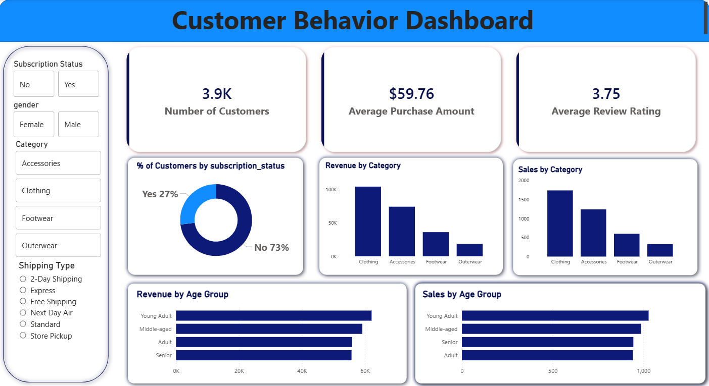
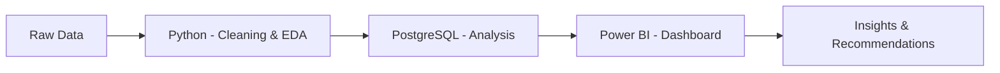

# 👩🏻‍💻 Customer Shopping Behavior Analysis

### 📊 End-to-End Data Analytics Project

<p align="center">
  
  
  
</p>

---

## 🎯 Project Summary

This project presents a **complete data analytics workflow**, transforming raw customer transaction data into **actionable business insights**.

It highlights my ability to:

* Clean and preprocess real-world data
* Perform SQL-based business analysis
* Build **interactive dashboards**
* Communicate insights effectively

---

## 🎨 Dashboard Preview

<p align="center">
  
</p>


---

## 🚀 Key Metrics

| Metric          | Value  |
| --------------- | ------ |
| 👥 Customers    | 3.9K   |
| 💰 Avg Purchase | $59.76 |
| ⭐ Avg Rating    | 3.75   |

---

## 📊 Insights Snapshot

* 📈 **Clothing category** generates highest revenue
* 👥 **Young adults** contribute most to sales
* 🔁 Subscription users show **higher engagement**
* 🚚 Shipping preferences influence purchasing patterns

---

## 🔄 Workflow



---

## 🛠️ Tech Stack

<p align="center">


</p>

---

## 📂 Repository Structure

```bash
├── notebooks/
├── sql/
├── dashboard/
├── images/
└── README.md
```

---

## ⚙️ Setup Instructions

### 1️⃣ Clone Repository

```bash
git clone https://github.com/samikshapawar08/Customer_shopping_behavior_analysis.git
```

### 2️⃣ Run Python Notebook

* Open Jupyter Notebook
* Execute all cells

### 3️⃣ SQL Analysis

* Load dataset into PostgreSQL
* Run SQL queries

### 4️⃣ Dashboard

* Open `.pbix` file in Power BI
* Connect to database

---

## 📚 Key Learnings

✔️ End-to-end analytics pipeline

✔️ Writing business-focused SQL queries

✔️ Data cleaning & transformation

✔️ Dashboard storytelling

✔️ Real-world problem solving

---

## 🔮 Future Improvements

* Advanced SQL (CTEs, Window Functions)
* Predictive analytics (ML models)
* Dashboard UX enhancements
* Larger datasets

---

## 🤝 Connect With Me

<p align="center">
  <a href="www.linkedin.com/in/samiksha-pawar-aa1018266"></a>
  <a href="#"></a>
</p>

---

## ⭐ Support

If you like this project, consider giving it a ⭐ on GitHub!

---

<p align="center">
  <b>“Turning Data into Decisions 📊”</b>
</p>
